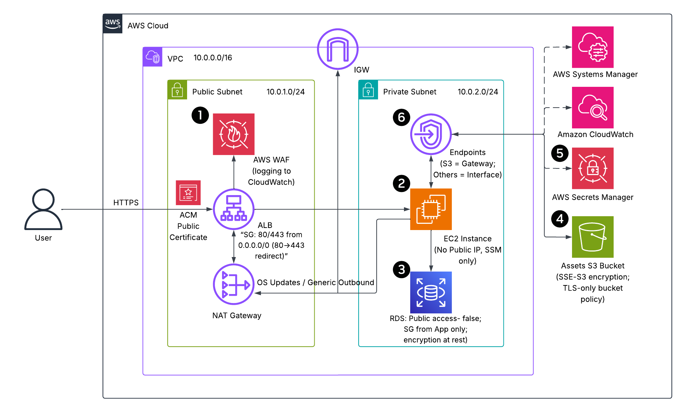
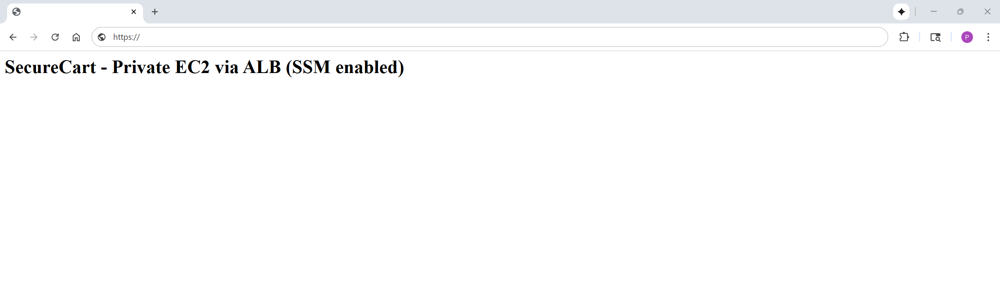

# SecureCart - Secure Application Deployment on AWS (Security Pillar)  
ALB→EC2/RDS in private subnets with WAF + managed rules; signals: least-privilege IAM, encrypted at rest/in-transit.  

A security-focused refactor of a deliberately vulnerable e-commerce stack. This project shows how to redesign an internet-exposed environment into a **defense-in-depth** architecture using **AWS-native** controls and **nested CloudFormation**.  

The application is intentionally minimal (an nginx page) so the repo can center on **security**: private subnets, SG chaining, WAF, TLS, Secrets Manager, SSM, VPC endpoints, and encrypted data stores.  

[](https://github.com/patrick-heese/aws-securecart-security-pillar/actions/workflows/infra-ci.yml)  

## Architecture Overview  
  
*Figure 1: SecureCart - Security-Focused Architecture*  

### Legend (callouts)  
1. **WAF** in front of ALB filters common threats (SQLi, bad inputs).  
2. **Application EC2** in private subnets, reachable only from ALB.  
3. **RDS** private, reachable only from Application SG (encryption at rest).  
4. **S3** private with TLS-only bucket policy; EC2 role is read-only.  
5. **Secrets Manager** stores DB creds (EC2 reads `AWSCURRENT` at runtime).  
6. **PrivateLink endpoints** for SSM/Secrets/S3/Logs keep traffic off the public internet.  

> **Solid** arrows = data path; **dashed** arrows = control plane (SSM, Secrets, Logs).  

> The repo also includes an **insecure baseline** template *(optional)* so you can contrast anti-patterns vs. the **hardened** design.  

## Skills Applied  
- Designing AWS security architecture (VPC segmentation, least-privilege SGs, WAF).  
- Automating infrastructure with **AWS CloudFormation** (nested stacks, S3 TemplateURL parameters).  
- Scoping least-privilege **IAM** roles for EC2 (SSM core, bucket-scoped read, scoped `secretsmanager:GetSecretValue`).  
- Referencing secrets dynamically with **AWS Secrets Manager** (dynamic references).  
- Administering instances via **SSM Session Manager** (no public SSH).  
- Routing private service access via **VPC endpoints** (S3 Gateway; SSM/Secrets/Logs interfaces).  
- Terminating **TLS** at the edge (ALB + ACM) and encrypting data at rest (RDS, S3 SSE-S3).  

## Features (security-centric)  
- **Edge protection:** AWS WAF managed rules (Common, Bad Inputs, SQLi).  
- **Zero public ingress to compute:** EC2 in private subnet, SG allows only ALB → EC2 (HTTP in demo).  
- **Data layer hardening:** RDS private, SG from Application server only, encryption at rest.  
- **Secret management:** DB creds in Secrets Manager; application role can only read `AWSCURRENT`.  
- **S3 hardening:** Private bucket with TLS-only bucket policy; EC2 role is read-only and bucket-scoped.  
- **Admin access without SSH:** SSM Session Manager via interface endpoints.  

## Tech Stack  
- **AWS Services:** VPC, IGW, NAT Gateway, EC2, ALB, WAF, RDS, S3, Secrets Manager, SSM, CloudWatch Logs, VPC Endpoints  
- **IaC:** AWS CloudFormation (nested stacks)  
- **Other:** AWS CLI, PowerShell (examples), MariaDB/MySQL client (for DB check)  

## Deployment Instructions  
> **Note:** Many commands are identical across shells; the main differences are line continuation (PowerShell: `` ` `` • Bash: `\` • cmd.exe: `^`), environment variables (PowerShell: `$env:NAME=...` • Bash: `NAME=...` • cmd.exe: `set NAME=...`), and path separators.  

### CloudFormation  
1. Clone this repository.  

2. Deploy the `s3-bucket.yaml` template to create an S3 bucket for nested CloudFormation templates:  
    ```powershell
	cd cloudformation
	aws cloudformation deploy `
	--stack-name sc-templates-bucket `
	--template-file s3-bucket.yaml `
	--parameter-overrides BucketPrefix=securecart-templates
	--tags Project=aws-securecart-security-pillar
	```
	
	Grab the bucket name:  
	```
	$TEMPL_BUCKET = (aws cloudformation describe-stacks --stack-name sc-templates-bucket |
	ConvertFrom-Json).Stacks[0].Outputs |
	? { $_.OutputKey -eq 'TemplatesBucketName' } |
	% { $_.OutputValue }
	```

3. Upload the nested CloudFormation templates to the S3 bucket:  
    ```powershell
	aws s3 cp phase1-networking.yaml s3://$TEMPL_BUCKET/cfn/
	aws s3 cp phase2-compute.yaml    s3://$TEMPL_BUCKET/cfn/
	aws s3 cp phase3-data.yaml       s3://$TEMPL_BUCKET/cfn/
	aws s3 cp phase4-waf.yaml        s3://$TEMPL_BUCKET/cfn/
	```

4. Edit the `params.json` and `parent-template.yaml` file to customize the deployment.  
   - `KeyName` is an optional parameter to set the SSH key pair that will be used to SSH to the application server for any additional configuration or troubleshooting. This can be created separately in the AWS Management Console under EC2 > Key Pairs.  
   - `DBMasterName` is the username that will be used to access the RDS instance.  
   - `CertificateArn` is the ARN of the ACM TLS certificate used to enable HTTPS. To use the application without a certificate, remove this parameter as well as the HTTPS listener and redirect in `phase2-compute.yaml`.  
   - `Phase*TemplateURL` is the Object URL of each nested template (e.g., https://<YOUR_BUCKET_NAME>.s3.<YOUR_REGION>.amazonaws.com/cfn/phase1-networking.yaml).  
   - The default values for `PublicSubnet1Cidr`, `PublicSubnet2Cidr`, `PrivateSubnet1Cidr`, and `PrivateSubnet2Cidr`can be edited in the `parent-template.yaml` file. `PublicSubnetB` and `PrivateSubnetB` are included in the `phase1-networking.yaml` file for future high availability use.  

5. Deploy the CloudFormation stack:  
    ```powershell
	aws cloudformation deploy `
	--stack-name sc-parent `
	--template-file parent-template.yaml `
	--parameter-overrides file://params.json `
	--capabilities CAPABILITY_NAMED_IAM `
	--tags Project=aws-securecart-security-pillar
	```

6. *(Optional)* The repo includes `insecure-baseline.yaml` that demonstrates common anti-patterns (public EC2 with 22/80 open, public RDS, public S3, overly-permissive instance role). Deploy separately if you want to compare behaviors; it’s not referenced by the parent template. Check `insecure-baseline.yaml` for the exact parameter names and adjust if needed. Create the SSM SecureString parameter `/securecart/db/master_password` to deploy.  
    ```powershell
	aws cloudformation deploy `
	--stack-name sc-insecure `
	--template-file insecure-baseline.yaml `
	--parameter-overrides KeyName=<YourKey> `
	--capabilities CAPABILITY_NAMED_IAM `
	--tags Project=aws-securecart-security-pillar-insecure-baseline
	```

> **Note**: Ensure the AWS CLI user (`aws configure`) or CloudFormation assumed role has sufficient permissions to manage **S3**, **EC2**, **RDS**, **VPCs**, **Subnets**, **Route Tables**, **NAT Gateways**, **IGW**, **ALB**, **Security Groups**, and **IAM resources**.  

## How to Use (Validate Security Controls)  
1. **Deploy the infrastructure** using CloudFormation and collect outputs:  
	```powershell
	$parent = aws cloudformation describe-stacks --stack-name sc-parent | ConvertFrom-Json
	$AlbDNS  = ($parent.Stacks[0].Outputs | ? { $_.OutputKey -eq 'AlbDNSName' }).OutputValue
	$Bucket  = ($parent.Stacks[0].Outputs | ? { $_.OutputKey -eq 'AssetsBucketName' }).OutputValue
	$DbHost  = ($parent.Stacks[0].Outputs | ? { $_.OutputKey -eq 'RdsEndpoint' }).OutputValue
	$AlbArn  = (aws cloudformation list-exports | ConvertFrom-Json).Exports | ? { $_.Name -eq 'SecureCart-Compute-AlbArn' } | % { $_.Value }
	```
	
2. **HTTPS + redirect:**  
	```powershell
	# Should 301 redirect to HTTPS
	Invoke-WebRequest -Uri ("http://{0}" -f $AlbDNS) -MaximumRedirection 0 -ErrorAction SilentlyContinue | Select-Object StatusCode, Headers

	# If using ALB DNS (no custom domain), cert won't match; keep SkipCertificateCheck. Should return with a 200 status code.
	Invoke-WebRequest -Uri ("https://{0}" -f $AlbDNS) -UseBasicParsing -SkipCertificateCheck | Select-Object StatusCode
	```
	
3. **Instance has no public IP and is SSM-managed:**  
	```powershell
	aws ec2 describe-instances `
	--filters "Name=tag:Name,Values=securecart-app-ec2" | ConvertFrom-Json | % { $_.Reservations.Instances } | Select-Object InstanceId,PrivateIpAddress,PublicIpAddress,SubnetId

	aws ssm describe-instance-information | ConvertFrom-Json | % { $_.InstanceInformationList } | Select-Object InstanceId, PingStatus, PlatformName
	```

4. **S3 is private to the world, readable from the instance:**  
	```powershell
	Invoke-WebRequest -Uri ("https://{0}.s3.{1}.amazonaws.com/hello.txt" -f $Bucket, (aws configure get region)) `
	-Method GET -ErrorAction SilentlyContinue | Select-Object StatusCode
	# Expect 403/AccessDenied
	```
	
	```bash
	# Run from an SSM session (on the EC2)
	echo "hello-secure" > /tmp/hello.txt
	ASSETS_BUCKET=securecart-assets-493233983993 
	aws s3 cp /tmp/hello.txt s3://$ASSETS_BUCKET/hello.txt
	aws s3 cp s3://$ASSETS_BUCKET/hello.txt /tmp/roundtrip.txt && cat /tmp/roundtrip.txt
	```

5. **Secrets Manager at runtime (from the instance):**  
	```bash
	# Inside SSM session
	sudo wget https://dev.mysql.com/get/mysql80-community-release-el9-1.noarch.rpm 
	sudo dnf install mysql80-community-release-el9-1.noarch.rpm -y
	sudo dnf install mysql-community-server -y
	sudo dnf -y install jq mysql || true
	TOKEN=$(curl -s -X PUT "http://169.254.169.254/latest/api/token" -H "X-aws-ec2-metadata-token-ttl-seconds: 300")
	REGION=$(curl -s -H "X-aws-ec2-metadata-token: $TOKEN" http://169.254.169.254/latest/dynamic/instance-identity/document | jq -r .region)
	ACCOUNT=$(aws sts get-caller-identity --query Account --output text)
	DB_SECRET_NAME="securecart-db-credentials-${ACCOUNT}-${REGION}"
	SECRET_JSON=$(aws secretsmanager get-secret-value --secret-id "$DB_SECRET_NAME" --version-stage AWSCURRENT --query SecretString --output text --region "$REGION")
	DB_USER=$(echo "$SECRET_JSON" | jq -r .username)
	DB_PASS=$(echo "$SECRET_JSON" | jq -r .password)
	mysql -h "<paste RDS endpoint from outputs>" -u "$DB_USER" -p"$DB_PASS" -e "SELECT VERSION();"
	```
	
6. **RDS is private and encrypted:**  
	```powershell
	Test-NetConnection -ComputerName $DbHost -Port 3306
	# Expect TcpTestSucceeded = False
	```
	
	```powershell
	aws rds describe-db-instances `
	--query "DBInstances[?Endpoint.Address=='$DbHost'].{Encrypted:StorageEncrypted,Public:PubliclyAccessible}" | ConvertFrom-Json
	# Expect Encrypted = true, Public = false
	```
	
7. **WAF is attached and inspecting traffic:**  
	```powershell
	# Get WebACL ARN from the export
	$WebAclArn = (
	aws cloudformation list-exports | ConvertFrom-Json
	).Exports | Where-Object { $_.Name -eq 'SecureCart-WAF-WebAclArn' } |
	Select-Object -ExpandProperty Value
	
	# Show ALBs associated to that WebACL
	aws wafv2 list-resources-for-web-acl `
	--web-acl-arn $WebAclArn `
	--resource-type APPLICATION_LOAD_BALANCER `
	--region (aws configure get region) | ConvertFrom-Json
	```
	
	```powershell
	# Test with SQLi probes (expect 403 if a rule fires)
	function Test-UrlStatus { param([string]$Url)
	try { (Invoke-WebRequest -Uri $Url -MaximumRedirection 0 -SkipCertificateCheck -ErrorAction Stop).StatusCode }
	catch { if ($_.Exception.Response) { [int]$_.Exception.Response.StatusCode.value__ } else { throw } }
	}
	Test-UrlStatus ("https://{0}/?id=1%20OR%201=1" -f $AlbDNS)
	Test-UrlStatus ("https://{0}/?q=UNION%20SELECT%20NULL,NULL" -f $AlbDNS) 
	```

## Project Structure  
```plaintext
aws-securecart-securitypillar
├── .github/                             
│   └── workflows/                       
│       └── infra-ci.yml                  # Caller workflow → reusable IaC Gate
├── assets/                               # Images, diagrams, screenshots
│   ├── architecture-diagram.png          # Project architecture diagram
│   └── application-screenshot.png        # Minimal application screenshot
├── cloudformation/                       # CloudFormation templates
│   ├── parent-template.yaml              # Wires phases (nested stacks from S3 URLs)
│   ├── phase1-networking.yaml            # VPC, subnets, IGW, NAT, endpoints
│   ├── phase2-compute.yaml               # ALB (HTTP+HTTPS), private EC2, SSM
│   ├── phase3-data.yaml                  # RDS (private, encrypted), S3 (private), Secrets
│   ├── phase4-waf.yaml                   # WAFv2 WebACL and ALB association
│   ├── params.json                       # Parent parameters (Template URLs, Cert ARN, etc.)
│   ├── s3-bucket.yaml                    # Bucket to host nested templates
│   └── insecure-baseline.yaml            # Optional insecure stack (not referenced by parent)
├── LICENSE                               
├── README.md                             
└── .gitignore                            
```  

## Screenshot  
  
*Figure 2: Minimal application page (the focus is the security architecture).*  

## Future Enhancements  
- Add **CloudWatch metrics & alarms** for WAF, ALB, EC2, RDS, and S3 access patterns  
- **TLS to backend** (ALB → EC2) with instance certs and HTTPS target group  
- **KMS CMK** (customer-managed keys) with rotation for RDS and S3  
- **CI/CD** (GitHub Actions) to lint/validate CFN and deploy stacks  
- **Cost adjustments** (reduce NAT egress by adding more endpoints actually used)  

## License  
This project is licensed under the [MIT License](LICENSE).  

---

## Author  
**Patrick Heese**  
Cloud Administrator | Aspiring Cloud Engineer/Architect  
[LinkedIn Profile](https://www.linkedin.com/in/patrick-heese/) | [GitHub Profile](https://github.com/patrick-heese)  

## Acknowledgments  
This project was inspired by a course from [techwithlucy](https://github.com/techwithlucy).  
The architecture diagram included here is my own version, adapted from the original course diagram.  
I designed and developed all Infrastructure as Code (CloudFormation) and project documentation.  